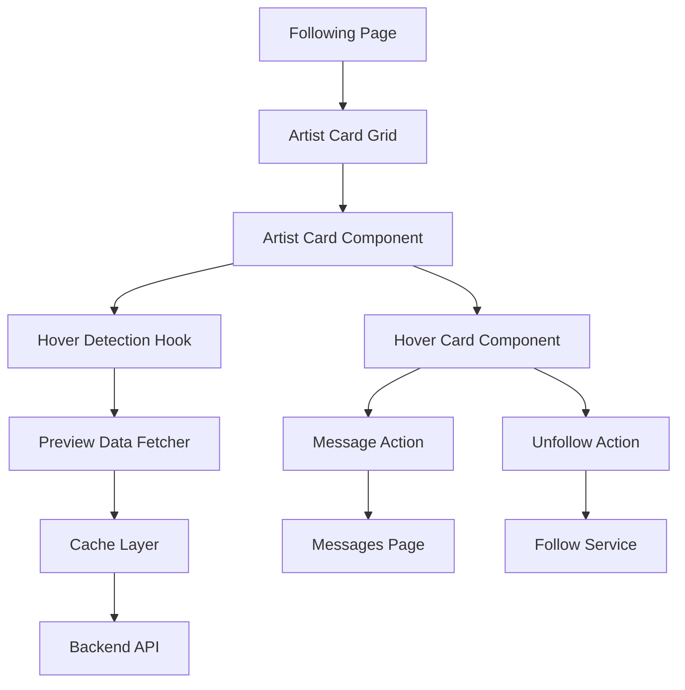

# Design Document

## Overview

The Artist Hover Card feature provides an interactive, performant preview system for followed artists on the Following page. The design emphasizes smooth animations, intelligent caching, and minimal API overhead while delivering rich contextual information to users.

## Architecture

### System Components



### Technology Stack

- **Frontend Framework**: React 18+ with hooks
- **Animation Library**: Framer Motion for smooth transitions
- **State Management**: React Query for caching and data fetching
- **Styling**: CSS Modules with design system variables
- **Backend**: Express.js with MongoDB
- **Caching**: In-memory cache with TTL (30 seconds)
- **Real-time**: Socket.IO for online status updates

## Components and Interfaces

### Frontend Components

#### 1. ArtistCard Component

**Purpose**: Display individual artist information with hover detection

**Props**:
```typescript
interface ArtistCardProps {
  artist: {
    _id: string;
    username: string;
    profile: {
      avatar: string;
      bio?: string;
    };
    followedAt: Date;
  };
  onUnfollow: (artistId: string) => void;
}
```

**State**:
- `isHovered`: boolean - tracks hover state
- `hoverTimeout`: NodeJS.Timeout - debounce timer

**Behavior**:
- Triggers preview fetch after 300ms hover
- Cancels fetch if mouse leaves before 300ms
- Positions hover card relative to viewport

#### 2. ArtistHoverCard Component

**Purpose**: Display rich preview with artist info, artworks, and actions

**Props**:
```typescript
interface ArtistHoverCardProps {
  artistId: string;
  position: { x: number; y: number };
  onClose: () => void;
  onMessage: (artistId: string) => void;
  onUnfollow: (artistId: string) => void;
}
```

**Sections**:
1. **Header**: Avatar, username, bio, follow date
2. **Status Indicators**: Online status, activity badges
3. **Mini Gallery**: 3 recent artwork thumbnails
4. **Actions**: Message and Unfollow buttons

**Animation**:
```javascript
const variants = {
  hidden: { opacity: 0, y: 10, scale: 0.95 },
  visible: { opacity: 1, y: 0, scale: 1 },
  exit: { opacity: 0, y: 5, scale: 0.98 }
};
```

#### 3. useArtistPreview Hook

**Purpose**: Manage preview data fetching and caching

**Interface**:
```typescript
function useArtistPreview(artistId: string | null) {
  return {
    data: ArtistPreview | null;
    isLoading: boolean;
    error: Error | null;
    refetch: () => void;
  };
}
```

**Implementation**:
- Uses React Query with 30-second stale time
- Implements exponential backoff for retries
- Prefetches data for visible artists using IntersectionObserver

### Backend Endpoints

#### GET /api/users/:id/mini-preview

**Purpose**: Fetch artist preview data with recent artworks

**Authentication**: Optional (public data)

**Response**:
```json
{
  "success": true,
  "data": {
    "user": {
      "_id": "507f1f77bcf86cd799439011",
      "username": "ArjunYadav",
      "profile": {
        "avatar": "https://cdn.example.com/avatars/arjun.jpg",
        "bio": "Digital Illustrator & Concept Artist"
      },
      "stats": {
        "followers": 1234,
        "artworks": 56
      },
      "isOnline": true,
      "lastActive": "2025-11-09T10:30:00Z"
    },
    "artworks": [
      {
        "_id": "507f1f77bcf86cd799439012",
        "title": "Dreamscape",
        "thumbnail": "https://cdn.example.com/artworks/thumb1.jpg",
        "createdAt": "2025-11-08T15:20:00Z"
      }
    ],
    "followedAt": "2025-10-15T08:00:00Z"
  }
}
```

**Caching Strategy**:
- Cache key: `artist_preview:${userId}`
- TTL: 30 seconds
- Invalidation: On artist profile update or artwork upload

**Query Optimization**:
```javascript
// Fetch only necessary fields
const user = await User.findById(userId)
  .select('username profile.avatar profile.bio stats')
  .lean();

// Fetch top 3 artworks with minimal data
const artworks = await Artwork.find({
  artist: userId,
  status: 'approved',
  visibility: 'public'
})
  .select('title thumbnail createdAt')
  .sort({ createdAt: -1 })
  .limit(3)
  .lean();
```

## Data Models

### ArtistPreview Interface

```typescript
interface ArtistPreview {
  user: {
    _id: string;
    username: string;
    profile: {
      avatar: string;
      bio?: string;
    };
    stats: {
      followers: number;
      artworks: number;
    };
    isOnline: boolean;
    lastActive: Date;
  };
  artworks: Array<{
    _id: string;
    title: string;
    thumbnail: string;
    createdAt: Date;
  }>;
  followedAt: Date;
}
```

### Cache Entry Structure

```typescript
interface CacheEntry {
  key: string;
  data: ArtistPreview;
  timestamp: number;
  ttl: number;
}
```

## Error Handling

### Frontend Error States

1. **Network Error**: Display "Unable to load preview" with retry button
2. **Artist Not Found**: Display "Artist unavailable"
3. **Timeout**: Display loading skeleton for max 5 seconds, then error
4. **Rate Limit**: Display "Too many requests, please wait"

### Backend Error Responses

```javascript
// Artist not found
{
  "success": false,
  "error": "Artist not found",
  "code": "ARTIST_NOT_FOUND"
}

// Rate limit exceeded
{
  "success": false,
  "error": "Rate limit exceeded",
  "code": "RATE_LIMIT_EXCEEDED",
  "retryAfter": 60
}
```

### Error Recovery

- Automatic retry with exponential backoff (1s, 2s, 4s)
- Fallback to cached data if available
- Graceful degradation: Show basic info without artworks if fetch fails

## Testing Strategy

### Unit Tests

1. **useArtistPreview Hook**
   - Test debounce behavior
   - Test cache hit/miss scenarios
   - Test error handling and retries

2. **ArtistHoverCard Component**
   - Test rendering with complete data
   - Test rendering with missing data (no bio, no artworks)
   - Test action button clicks
   - Test animation lifecycle

3. **Position Calculation**
   - Test viewport overflow detection
   - Test positioning adjustments
   - Test responsive breakpoints

### Integration Tests

1. **Hover Flow**
   - Hover triggers preview fetch after 300ms
   - Preview displays with correct data
   - Mouse leave hides card after 250ms
   - Rapid hover/unhover cancels pending requests

2. **Actions**
   - Message button navigates to Messages page
   - Unfollow button shows confirmation modal
   - Successful unfollow removes artist from list
   - Toast notification appears after unfollow

3. **Caching**
   - Second hover uses cached data
   - Cache expires after 30 seconds
   - Cache invalidates on artist update

### Performance Tests

1. **Load Time**
   - Preview fetch completes within 500ms
   - Cached preview displays within 50ms
   - Animation completes within 200ms

2. **Memory Usage**
   - Cache size stays under 10MB
   - No memory leaks on repeated hover/unhover
   - Proper cleanup on component unmount

3. **Network Efficiency**
   - Debouncing prevents excessive requests
   - Prefetching reduces perceived latency
   - Batch requests for multiple visible artists

## Performance Optimizations

### 1. Request Debouncing

```javascript
const debouncedFetch = useMemo(
  () => debounce((artistId) => {
    fetchPreview(artistId);
  }, 300),
  []
);
```

### 2. Intersection Observer Prefetching

```javascript
useEffect(() => {
  const observer = new IntersectionObserver(
    (entries) => {
      entries.forEach((entry) => {
        if (entry.isIntersecting) {
          const artistId = entry.target.dataset.artistId;
          queryClient.prefetchQuery(['artistPreview', artistId]);
        }
      });
    },
    { rootMargin: '100px' }
  );

  artistCards.forEach((card) => observer.observe(card));
  return () => observer.disconnect();
}, [artistCards]);
```

### 3. Image Lazy Loading

```javascript

```

### 4. Backend Caching

```javascript
const cache = new Map();

function getCachedPreview(userId) {
  const entry = cache.get(`artist_preview:${userId}`);
  if (entry && Date.now() - entry.timestamp < 30000) {
    return entry.data;
  }
  return null;
}

function setCachedPreview(userId, data) {
  cache.set(`artist_preview:${userId}`, {
    data,
    timestamp: Date.now()
  });
}
```

## Responsive Design

### Breakpoints

- **Desktop (>= 1024px)**: Full hover card with all features
- **Tablet (768px - 1023px)**: Compact hover card, smaller artwork previews
- **Mobile (< 768px)**: Hover disabled, tap to view full profile

### Touch Device Handling

```javascript
const isTouchDevice = 'ontouchstart' in window;

if (isTouchDevice && window.innerWidth < 768) {
  // Disable hover, use tap to navigate to profile
  return <Link to={`/profile/${artist._id}`}>{artistCard}</Link>;
}
```

## Accessibility

1. **Keyboard Navigation**: Hover card appears on focus, actions accessible via Tab
2. **Screen Readers**: ARIA labels for all interactive elements
3. **Focus Management**: Focus trap within hover card when using keyboard
4. **Color Contrast**: All text meets WCAG AA standards
5. **Reduced Motion**: Respect `prefers-reduced-motion` for animations

```javascript
const prefersReducedMotion = window.matchMedia(
  '(prefers-reduced-motion: reduce)'
).matches;

const animationDuration = prefersReducedMotion ? 0 : 200;
```

## Security Considerations

1. **Rate Limiting**: Max 30 preview requests per minute per user
2. **Input Validation**: Sanitize artist IDs to prevent injection
3. **Authorization**: Verify user is authenticated for unfollow action
4. **XSS Prevention**: Sanitize artist bio and artwork titles
5. **CORS**: Restrict API access to allowed origins

## Real-time Features

### Online Status Updates

```javascript
// Backend: Emit status change
io.to(userId).emit('user:status', {
  userId,
  isOnline: true,
  lastActive: new Date()
});

// Frontend: Listen for updates
socket.on('user:status', (data) => {
  queryClient.setQueryData(['artistPreview', data.userId], (old) => ({
    ...old,
    user: { ...old.user, isOnline: data.isOnline }
  }));
});
```

### Activity Badges

- **Recently Active**: Last active within 24 hours
- **Recently Posted**: Uploaded artwork within 7 days
- **Live Streaming**: Currently streaming (future feature)

## Future Enhancements

1. **Smart Recommendations**: "People who follow this artist also follow..."
2. **Quick Stats**: Hover to see detailed follower/artwork counts
3. **Preview Artwork**: Click thumbnail to open artwork modal
4. **Collaborative Filtering**: Suggest similar artists
5. **Batch Actions**: Multi-select artists for bulk unfollow
